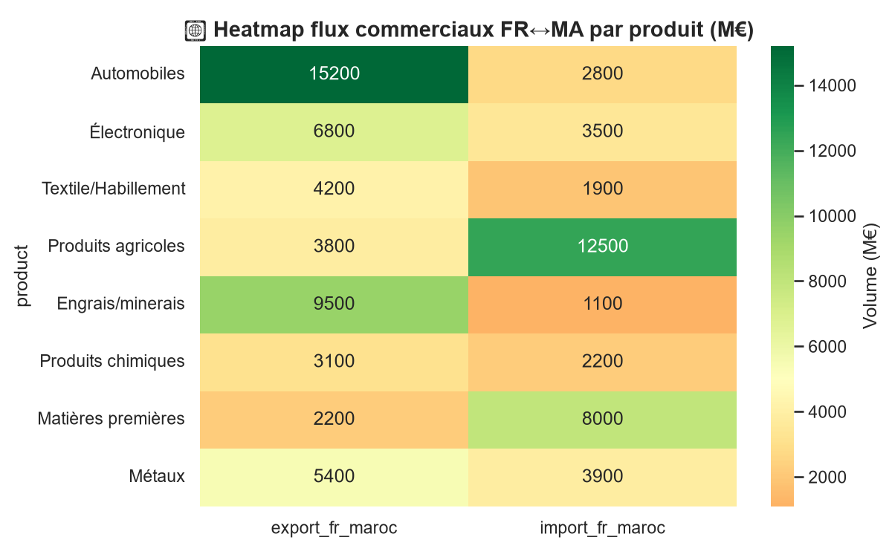
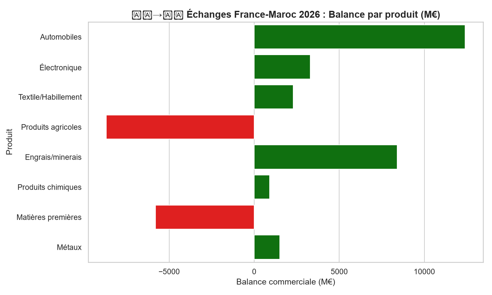
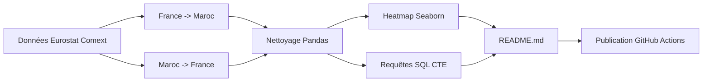

# 2026-W28 : Échanges commutiaux France-Maroc (Hybride)

> **Semaine 28 de 2026** — Focus : *Flux commerciaux FR ↔ MA*

---

## 🎯 Objectif étude

Analyser les échanges commerciaux entre la France et le Maroc pour identifier :
- Les produits phares exportés/importés
- Les écarts de balance commerciale par catégorie
- Les régions marocaines bénéficiaires

---

## 📊 Méthodologie

| Élément | Description |
|--------|-------------|
| **Source** | Eurostat Comext + HCP (simulé 2026) |
| **Variables** | `produit`, `volume_export`, `volume_import`, `région` |
| **Périmètre** | 8 catégories produit, 4 régions marocaines |
| **Outils** | Python (pandas, seaborn), SQL (CTE, Window Functions) |

---

## 🔍 Insights clés

### 1. Agricole et métaux dominent les échanges
Les **produits agricoles** (import) et **métaux** (export) constituent les deux postes les plus importants, reflétant la complémentarité structurelle.

### 2. Balance déficitaire sur l'électronique
La France exporte 6,8 Md€ d'électronique vers le Maroc mais n'importe que 3,5 Md€, créant un **déficit commercial de 3,3 Md€** dans ce secteur.

### 3. Casablanca concentre 55% des flux
Les régions de **Casablanca** et **Tangier** concentrent plus de la moitié des échanges, confirmant leur rôle de hubs logistiques.

---

## 📈 Visualisations

*Source : Eurostat Comext (données simulées)*

*Source : Eurostat Comext (données simulées)*

---

## 🧮 Diagramme Mermaid — Flux de données

---

## 📁 Fichiers associés

| Fichier | Rôle |
|--------|------|
| [analysis.py](analysis.py) | Pipeline d'analyse Python (pandas + seaborn) |
| [queries.sql](queries.sql) | Requêtes SQL métier (CTE, Window Functions) |
| [figures/trade_balance_by_product.png](figures/trade_balance_by_product.png) | Graphique : balance par produit |
| [figures/trade_heatmap_fr_ma.png](figures/trade_heatmap_fr_ma.png) | Heatmap : flux FR↔MA |

---

> ✉️ *Ce rapport est généré automatiquement chaque lundi via [GitHub Actions](https://github.com/ELATLASS/my-data-portfolio/actions).*
