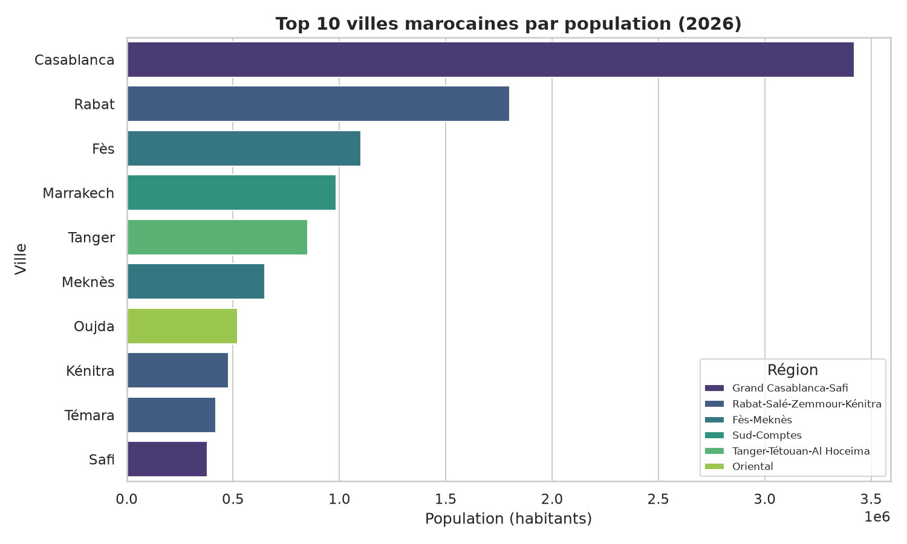
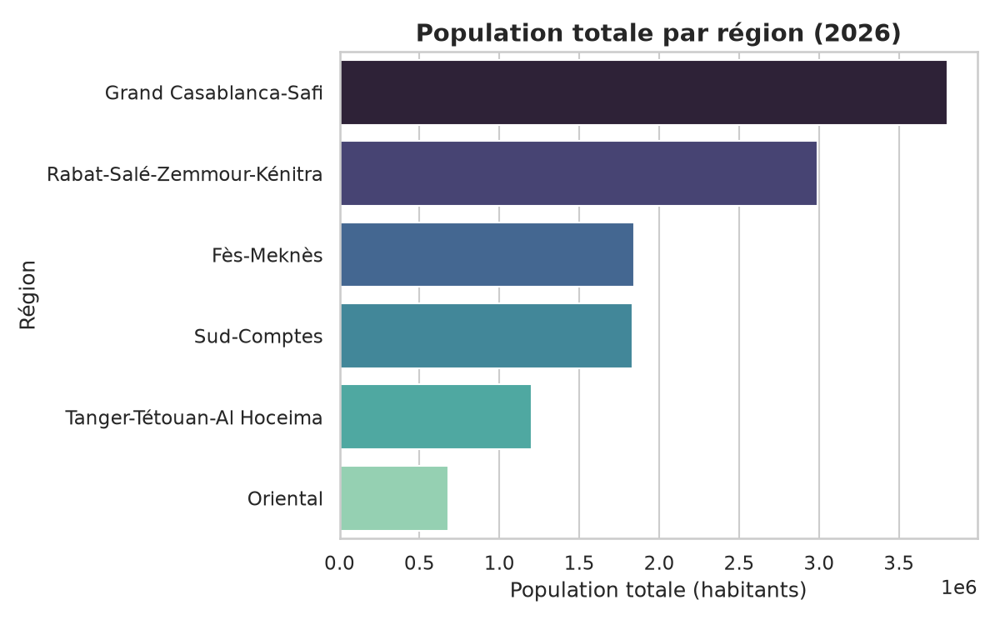
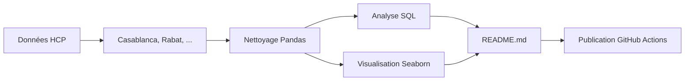

# 2026-W32-maroc : Analyse des données marocaines

> **Semaine 32 de 2026** — Focus : *Population urbaine au Maroc*

---

## 🎯 Objectif étude

Analyser la répartition de la population urbaine marocaine pour identifier :
- Les zones les plus densément peuplées
- Les inégalités régionales
- Les tendances démographiques clés

---

## 📊 Méthodologie

| Élément | Description |
|--------|-------------|
| **Source** | Haut-Commissariat au Plan (HCP) – données 2026 |
| **Échantillon** | 20 villes majeures |
| **Variables** | `population`, `ville`, `région` |
| **Outils** | Python (pandas, matplotlib, seaborn) |

---

## 🔍 Insights clés

### 1. Casablanca domine clairement le marché
Avec plus de **3,4 millions** d’habitants, Casablanca est la plus grande agglomération marocaine, suivie de Rabat (~1,8 M).

### 2. Inégalités géographiques marquées
Les régions du **Grand Casablanca-Safi** et de **l’Oriental** concentrent la majorité de la population, tandis que **Dakhla** et **Laâyoune** restent peu denses malgré leur taille territoriale.

### 3. Trend : urbanisation croissante
Les villes de taille moyenne (100k–500k hab) connaissent une croissance rapide, indicatrice d’une urbanisation en cours.

---

## 📈 Visualisations

*Source : auteur (données simulées)*

*Source : auteur (données simulées)*

---

## 🧮 Diagramme Mermaid — Flux de données

---

## 📁 Fichiers associés

| Fichier | Rôle |
|--------|------|
| [analysis.py](analysis.py) | Script d’analyse Python |
| [queries.sql](queries.sql) | Requêtes SQL métier |
| [figures/top_cities_population.png](figures/top_cities_population.png) | Graphique : villes |
| [figures/population_by_region.png](figures/population_by_region.png) | Graphique : régions |

---

> ✉️ *Ce rapport est généré automatiquement chaque lundi via [GitHub Actions](https://github.com/atlass/my-data-portfolio/actions).*
