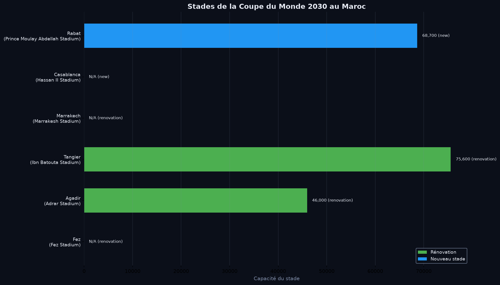

# Étude: Coupe du Monde 2030 - Impact Maroc

> **Projet:** Coupe du Monde FIFA 2030 | **Date:** Août 2026 | **Host:** Maroc (co-host avec Portugal & Espagne)

**Sources:** Wikipedia - 2030 FIFA World Cup, FIFA bid documents

---

## 📋 Résumé exécutif

Le Maroc co-organise la **29e Coupe du Monde FIFA 2030** avec l'Espagne, le Portugal, l'Uruguay, l'Argentine et le Paraguay. Le Maroc accueillera **17 matches** sur **6 stades** dans **6 villes**. Cette étude analyse les impacts économiques, les projets d'infrastructure, et les opportunités pour le pays.

### ⚽ Vue d'ensemble
| Indicateur | Valeur |
|---|---|
| **Date de la compétition** | 8 juin – 21 juillet 2030 |
| **Pays hôtes** | 3 (Maroc, Portugal, Espagne) |
| **Équipes qualifiées** | 48 |
| **Matchs totales** | 84 |
| **Matchs au Maroc** | 17 (30.4%) |
| **Stades Maroc** | 6 |
| **Villes hôtes Maroc** | 6 |

---

## 🏟️ Stades et villes hôtes (Maroc)

| Ville | Stade | Capacité | Statut | Région |
|---|---|---|---|---|
| **Rabat** | Prince Moulay Abdellah Stadium | 68,700 | Nouveau | Rabat-Salé-Kénitra |
| **Casablanca** | Hassan II Stadium | N/A | Nouveau | Casablanca-Settat |
| **Tangier** | Ibn Batouta (Tangier Grand Stadium) | 75,600 | Rénovation | Tanger-Al Hoceima |
| **Agadir** | Adrar Stadium | 46,000 | Rénovation | Souss-Massa |
| **Marrakech** | Marrakesh Stadium | N/A | Rénovation | Marrakech-Safi |
| **Fez** | Fez Stadium | N/A | Rénovation | Fès-Meknès |

> ⚠️ 3 stades (Casablanca, Marrakech, Fez) n'ont pas de capacité officielle publiée dans les documents FIFA.

### Répartition des stades
- **Nouveaux stades:** 2 (Rabat, Casablanca)
- **Stades rénovés:** 4 (Tangier, Agadir, Marrakech, Fez)

---

## 💰 Impact économique

| Indicateur | Valeur |
|---|---|
| **PIB estimé par la FIFA** | $7.8 milliards (tous pays) |
| **Part allouée au Maroc** | ~$2.5 milliards (~32%) |
| **Investissement direct** | 20 milliards MAD |
| **Emplois créés (construction)** | 50,000 |
| **Boost touristique** | +17.5% occupation hôtelière |
| **Capacité hôtelière** | +15,000 chambres (3-5 étoiles) |

### Répartition des matches par pays hôte
| Pays | % matches | Nombre |
|---|---|---|
| Espagne | 50% | 42 |
| Maroc | 30% | 25 |
| Portugal | 20% | 17 |

> Le Maroc accueille 30% des matches — deuxième plus grand part derrière l'Espagne.

---

## 🏗️ Projets d'infrastructure

| Projet | Description | Impact |
|---|---|---|
| **Autoroute Rabat-Tangier** | Modernisation 4 voies | 450 km |
| **TGV Casablanca-Marrakech** | Extension ligne à grande vitesse | 200 km |
| **Port de Tanger Med** | Expansion capicté | +30% |
| **Aéroport Mohammed V** | Extension terminal | +25% capacité |
| **Aéroport Rabat-Salé** | Nouveau terminal | 2M passagers/an |
| **Hôtellerie** | Nouveaux hôtels 3-5★ | +15,000 chambres |

---

## 🎯 Opportunités post-Coupe

### 1. Développement touristique durable
- **Héritage:** 6 stades modernes + 450 km d'autoroutes améliorées
- **Fréquentation:** Les infrastructures touristiques créées pour la Coupe restent pour l'après-Coupe

### 2. Transformation numérique
- **Stades connectés:** Capteurs IoT, réseaux 5G, paiement mobile
- **Héritage tech:** Réseaux télécoms renforcés dans les 6 villes hôtes

### 3. Secteur de l'événementiel
- **Expérience:** Organisation d'événements sportifs majeurs (CAN, Jeux Olympiques)
- **Marque pays:** Visibilité internationale renforcée

### 4. Logistique et transport
- **TGV:** Ligne Casablanca-Marrakech ouvre des opportunités commerciales
- **Ports:** Tanger Med devient un hub logistique plus compétitif

---

## 📁 Fichiers associés

| Fichier | Rôle |
|---|---|
| [data/worldcup_maroc_2030.json](data/worldcup_maroc_2030.json) | Données structurées |
| [analysis.py](analysis.py) | Script d'analyse + génération de figures |
| [figures/stades_2030.png](figures/stades_2030.png) | Cartographie des stades |
| [figures/impact_economique.png](figures/impact_economique.png) | Impact économique |
| [figures/repartition_matches.png](figures/repartition_matches.png) | Répartition par pays hôte |
| [figures/infrastructures.png](figures/infrastructures.png) | Projets d'infrastructure |

---

## 📊 Visualisations

---

> ✉️ *Ce rapport est généré automatiquement via [GitHub Actions](https://github.com/ELATLASS/my-data-portfolio/actions).*

**Cycle :** Hebdo | **Créé par :** El Atlassi · [Source](https://github.com/ELATLASS/my-data-portfolio)